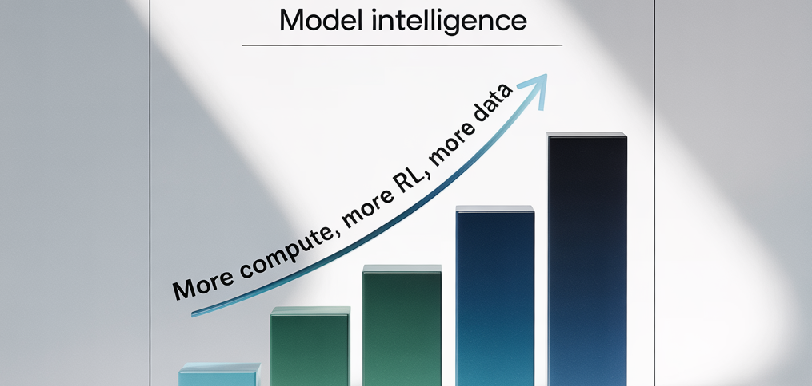
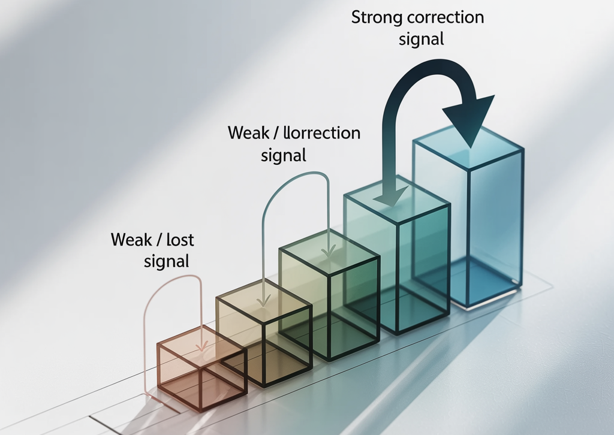
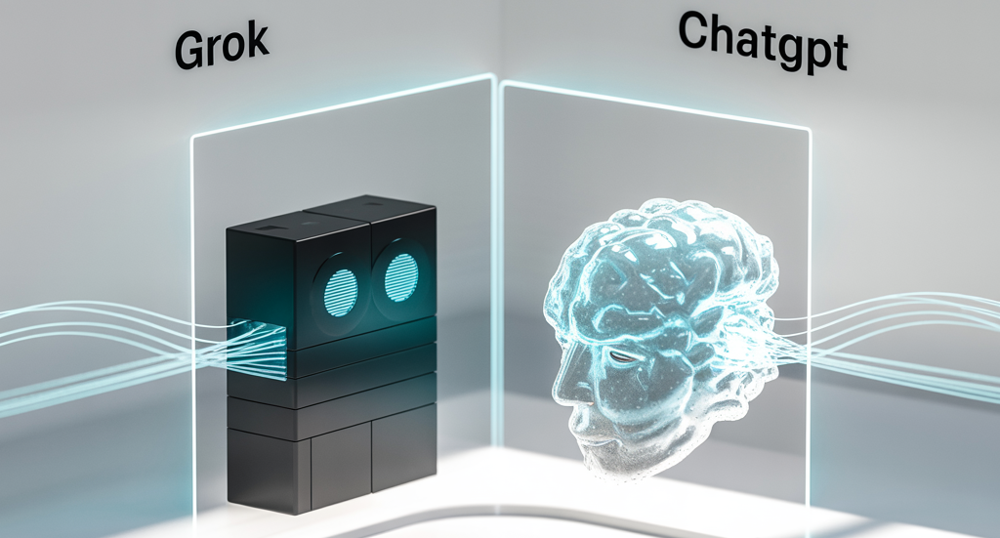

## What Does Altman Get That Musk Doesn’t? A Tale of Two AI Scaling Philosophies

In the grand arena of artificial intelligence, two titans are placing radically different bets on the future. On one side, Elon Musk’s xAI is on a brute-force quest for god-like intelligence, pushing its Grok model to be fundamentally *smarter*. On the other, Sam Altman’s OpenAI is meticulously equipping its models to be more *capable*, turning them into versatile agents that can act in our digital world.

This isn't just a product rivalry; it's a clash of philosophies. It’s a disagreement about the most viable path to progress, rooted in the deep technical realities of how AI models actually learn. The core of their divergence can be captured in two simple concepts: **vertical versus horizontal scaling.**

Elon, your strategy with Grok-4 is a clear play for vertical dominance. The reports are in: you’ve funneled immense computational resources—a proxy for money—into intensive Reinforcement Learning (RL) on your existing models. You’re trying to build a taller skyscraper; to increase the raw, intellectual horsepower of a single, powerful "brain."

Sam, your bet is horizontal. While you undoubtedly continue to research more powerful base models, OpenAI's public-facing strategy is all about building an ecosystem. With GPTs, advanced function calling, and a robust API, you're not just building a brain; you're giving it hands, eyes, and a toolbox. You're building a sprawling, interconnected city grid.

To understand why these paths are so different—and why one might be more pragmatic *right now*—we need to look under the hood.

### The Engine of Learning: Pre-training vs. Reinforcement Learning

For the last few years, AI development has followed a two-step dance.

1. **Pre-training:** This is the "university education" phase. A model is shown a colossal amount of text, images, and code from the internet. It isn't taught anything specific; it just learns patterns, context, grammar, and a base understanding of how the world is described. The result is a **pre-trained model**—a vast library of generalized knowledge.
2. **Reinforcement Learning (RL):** This is the "on-the-job training" phase. After its general education, the model is given specific tasks and rewarded for good performance. Humans (and other AIs) provide feedback, guiding the model to refine its skills for specific applications, like carrying a conversation or writing code. This is how Grok got "smarter" and ChatGPT got better at following instructions.

Recently, the industry has shifted its focus. Instead of building ever-larger universities (new, massive pre-trained models), companies are doubling down on providing more effective job training (RL) to their existing star graduates. It's more cost-effective and yields immediate results. This is precisely what xAI did with Grok-4. But this approach of making models incrementally "smarter" is a form of scaling that may be running into a wall.

### The Scaling Showdown: Vertical vs. Horizontal

Let's formally define the terms of this strategic battle.

**Vertical Scaling: The Skyscraper Approach**
Vertical scaling is about increasing a model's intrinsic intelligence. The goal is to make the core algorithm better, faster, and more profound in its reasoning. This is achieved through more data, more parameters, and, crucially, more computational power for training and refinement.

**Horizontal Scaling: The City Grid Approach**
Horizontal scaling is about increasing a model's capabilities by connecting it to external systems. The model’s core intelligence might not change, but its usefulness explodes. By giving it access to APIs, databases, code interpreters, and other tools, it can perform complex, multi-step tasks in the real world.

xAI’s pursuit of a smarter Grok is purely vertical. OpenAI's focus on an agentic ChatGPT is fundamentally horizontal. And the reason for this divergence isn't just business strategy—it's a hard technical limit.

### The Ghost in the Machine: Are We Reaching the Limits of Backpropagation?

For decades, the magic behind deep learning—the reason AI models can learn at all—has been an algorithm called **backpropagation**.

At its heart, backpropagation is a method for learning from mistakes. When a model produces a wrong output, the algorithm calculates the "error" and sends a correction signal backward through the model's layers of artificial neurons. It tells each neuron how much it contributed to the mistake and instructs it to adjust its parameters (its "weights") to do better next time.

Think of it like whispering a correction down a very long line of people.

This is the core flow, and it has a critical flaw: the **vanishing gradient problem**.

The further back the correction signal travels, the weaker and more diffused it becomes. By the time it reaches the earliest layers of a deep network, the signal can be so faint that those layers barely learn anything. The people at the start of the line can't hear the correction clearly enough to change their behavior.

This brings us to the crucial claim: **the incredible efficiency of backpropagation, the engine of the entire AI revolution, is hitting a wall of diminishing returns.** We can't just keep adding more layers and expect the model to get proportionally smarter, because our primary method for teaching those layers is becoming less effective with depth.

### The Inevitable Conclusion

This is what it all comes down to.

Elon, your vertical scaling strategy is a bet that you can overcome the fundamental limits of backpropagation with sheer force of compute. You are betting that you can make the whispers louder, forcing the correction signal through a taller and taller skyscraper. It's a noble goal, but it’s a high-risk, high-cost fight against the core mechanics of deep learning.

Sam, your horizontal scaling strategy appears to be a pragmatic acceptance of this current reality. It implicitly says: "If we can't easily build a taller skyscraper right now, let's build the most functional and powerful city around the ones we have." This approach sidesteps the backpropagation bottleneck by focusing on a different dimension of growth: capability, not just raw intellect.

The boundaries of backpropagation are what prevent us from scaling models vertically indefinitely. And unless a fundamentally new, innovative method of pre-training emerges—a different way to lay the foundation—we are stuck.

So, what does Sam Altman get that Elon Musk perhaps doesn't?

It may not be a secret insight into AGI. It may simply be the sober understanding of an engineer: you work with the tools you have, not the ones you wish you had. Right now, the most powerful and scalable tool in AI isn't just making a model *think* better, but enabling it to *do* more. The future, at least for now, seems to be horizontal.
